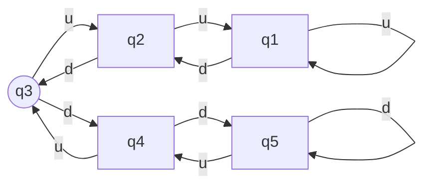
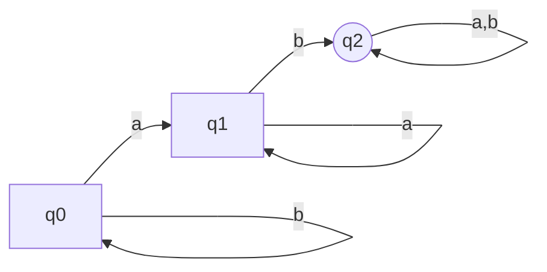

# 1.1
## a
$M_1 = q_1$

$M_2 = q_1$

## b
$M_1 = \{q_2\}$

$M_2 = \{q_1, q_4\}$

## c
$M_1 = (q_1, q_2, q_3, q_1, q_1)$

$M_2 = (q_1, q_1, q_1, q_2, q_4)$

## d
$M_1$ - No.

$M_2$ - Yes.

## e
$M_1$ - No.

$M_2$ - Yes.

# 1.2
$$
M_1 = (Q, \Sigma, \delta, q_0, F)\\
Q = \{q_1,q_2,q_3\}\\
\Sigma = \{a,b\}\\
q_0 = q_1\\
F = \{q_2\}
$$

|       |   a   |   b   |
| ----- | :---: | :---: |
| $q_1$ | $q_2$ | $q_1$ |
| $q_2$ | $q_3$ | $q_3$ |
| $q_3$ | $q_2$ | $q_1$ |

$$
M_2 = (Q, \Sigma, \delta, q_0, F)\\
Q = \{q_1, q_2, q_3, q_4\}\\
\Sigma = \{a,b\}\\
q_0 = q_1\\
F = \{q_1, q_4\}
$$

|       |   a   |   b   |
| ----- | :---: | :---: |
| $q_1$ | $q_1$ | $q_2$ |
| $q_2$ | $q_3$ | $q_4$ |
| $q_3$ | $q_2$ | $q_1$ |
| $q_4$ | $q_3$ | $q_4$ |

# 1.3

# 1.4

# 1.5

## a

$$
(Q, \Sigma, \delta, q_0, \{\})\\
Q = \{q_0\}\\
\Sigma = \{a,b\}\\
q_0 = q_0\\
F = \{\}\\
$$

|       |   a   |   b   |
| ----- | :---: | :---: |
| $q_0$ | $q_1$ | $q_0$ |
| $q_1$ | $q_1$ | $q_2$ |
| $q_2$ | $q_2$ | $q_2$ |

