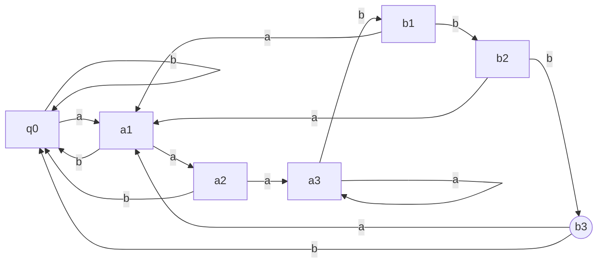
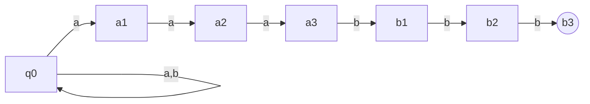

# Week Two, Lecture Two

## Review  :calendar: :back:

To represent the symbols of most programming languages, we could use:

$$
\Sigma := \{\_, a, \dots, z, 0, \dots, 9, +, <, =, \text{if}, \text{then}, ;\}
$$

where \_ means space.

Ignoring keywords:

```
38 symbols:
if counter<max then counter=counter+1;
```

Recognizing keywords:

```
34 symbols:
if counter<max then counter=counter+1;
^1 symbol      ^1 symbol
```

$\Sigma^+$ is a set of strings where they can be *one* or more symbols in $\Sigma$

$\Sigma^*$ is a set of strings where they can be *zero* or more symbols in $\Sigma$

- You can also think of it as $\Sigma \cup \{\epsilon\}$.

What about the Kleene plus and star applied to *languages* instead of alphabets?

First, we talk about "L to the i" before getting to "L to the plus" (Kleene plus applied to L) or "L to the star" (Kleene star applied to L). **"L to the i" is i words from L concatenated together.** e.g. $L^2$ is all combinations of two words from $L$ concatenated together.

$$
L^0 := \{\epsilon\}\\
L^i := \{w_1\dots w_j | 1 \leq j \leq i\}
$$

Recall that the transition function $\delta$ of a DFA is a function that takes the state of the machine and a member of the alphabet and returns a new state (i.e. $Q \times \Sigma \rightarrow Q$)

- Being a function is important because it means there is only possible state you can go to next ("single-valued")

- This is what makes it deterministic!

Two things are required for a DFA to be **correct**:

1. if $\text{input} \in L(M)$, then $M$ must accept the input

2. if $\text{input} \not\in L(M),$ then $M$ must reject the input

We can also think of a DFA as "choosy generator" which actually accepts no input, but rather guides the choices of some decision process to produce an output. Imagine you put your finger on a DFA and trace through its nodes as you want, with no particular order. When you're done, you check if the state you are in is an accepting state. If it is, then we say that the DFA actually generated the output. If it is not, then we say the DFA generated nothing.

## FSLs and Non-FSLs

ex: $\Sigma$ is "a" and "b" and $w$ is some string over the alphabet. If our language $L(w) := \{xw \, | \, x \in \Sigma^*\}$, then $L(w)$ is the set of all strings that end in $w$, including $w$ itself.

If we have a specific $w$ which is "aaabbb," then $L(w)$ is:



A benefit of math is that we can cleanly and easily express the above machine without nearly as much effort. Notice that our machine, in general, follows a pattern which almost looks like the Cartesian product of $\{a, b\} \times 0\dots 3$. This can be modeled by our transition function as:

$$
(a, i) \rightarrow_a (a, i + 1)
$$

What about **non-FSLs**? Here are some examples:

$$
\Sigma := \{a, b\}\\
\{ww \,|\, w \in \Sigma^*\}\\
\{ww^R \,|\, w \in \Sigma^*\}\\
\{w\#w^R \,|\, w \in \Sigma^*\}
$$

Informally, these are non-FSLs because we have no way of mapping, in a finite, computable way, all possible values of $w$. Every FSM must have a finite, fixed number of states. It must be the case, then, that for some string $w$, there is some collision in the output of $\delta$ for another, distinct string $w'$ whereby:

$$
\delta^*(q_0,w\#) = \delta^*(q_0,w'\#)
$$

But this is a contradiction as $w \ne w'$ as, according the FSM, they are equal.

<br></br>

## DFA to NFA

When we talked about what makes a computer a "computer," we talked about determinism. But how essential is that? What would it mean for a computer to have a "choice"? What could a computer do if it could make more than one transition for the same input?

A **nondeterministic finite automaton** will accept if any transition accepts. Thus, if a NFA does not accept an input, no single branch of computation accepted it.

An NFA differs from a DFA in its transition function. Rather than returning a single state, it returns a **set** of states, which will be a subset of $Q$. The NFA will also move without reading an input at each step. It doesn't have to, as an NFA is a generalization of a DFA, but it can.

Remember our earlier example of $L(aaabbb)$ with 7 states. A real mess! Well, it turns out that an NFA actually allows us to express this much more cleanly.



The **guess and check** view on NFAs assumes that whenever the machine has a choice, it's not that it takes every possible choice. It rather makes a guess that it is about to come to the accepting part of the string or that it's not. The only way to accept a string then is if the machine guesses correctly such that it ends on an accepting state.

- Rather than the backtracking/tree expansion view, where we spawn off a copy of the machine for each possibility, the guess and check view is much more restrained.

Another view is that the NFA is a convenient **intermediate representation** between a DFA and a true implementation.

- Where a DFA is like a programming language (both abstract, unrealized concepts) and the true implementation of it is the compiler (both concrete and real (as far as software can be)), the NFA is the intermediate, middle representation of the *pattern* of the programming language.

## Next Up :fast_forward:

Proving NFA and DFA equivalence with an algorithm.


