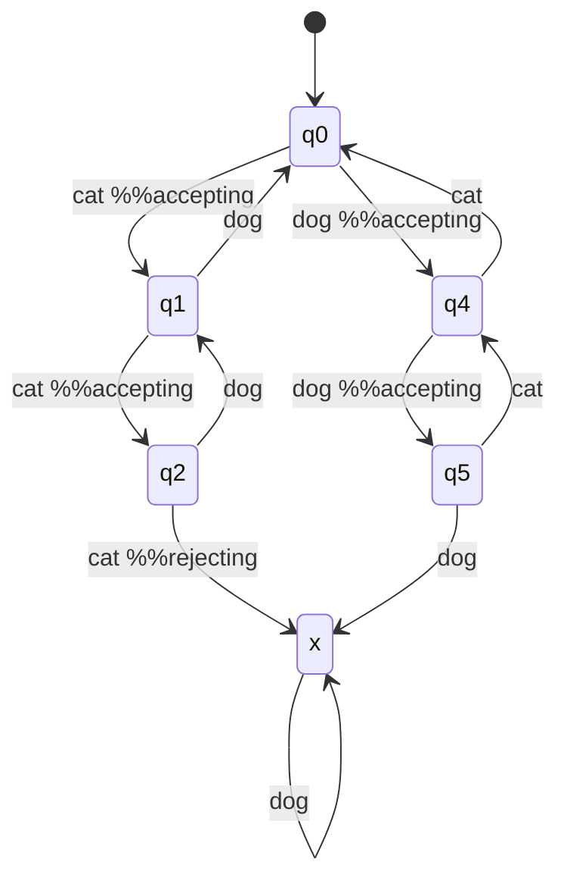

# Week One, Discussion

## What can computers NOT do?
- Intuition?
    - Arguably, intuition can be programmed through deep learning
- Winograd schema

## What does it mean for a computer to compute something?
- Flip bits?
- Take an input and perform an action?

## What is a computer?
We have to be very precise in this definition. What is a "machine"? What is an "operation"?

A starting point is the observation that all computers occupy finite space. This finite space can occupy only a finite number of states. Given this, computers can be described as **finite state machine** (FSM) or **deterministic finite automata** (DFA) where state transformations are binary data.

## FSM/DFAs
An FSA/DFA model *how we move through a graph* given an input and cover the class of **decision problems** which is defined as:
```
f: X -> Y is a decision problem iff:
Y = {0, 1} = {NO, YES} = {Rejecting, Accepting}
```
i.e. a decision problem is any problem which maps inputs to either a "yes" or a "no."

**Alphabet** = Nonempty finite set of symbols
**Language** = The set of strings that an FSM/DFA will accept
- A language of only zeroes can be defined as `L = {0^n | n ε N_0}`

**DFA** is defined by the following parameters:
- Q = a set of states (i.e. the nodes in the DFA)
    - ex: Q = {q0, q1, q2}
- ∑ = finite alphabet (i.e. the possible symbols in our input)
    - ex: ∑ = {0, 1}
- q0 = initial state
- ∂ = transition function such that `∂ : Q x ∑ -> Q` where `x` is the Cartesian product
    - `x`: {q0, q1} x {0, 1} = {(q0, 0), (q0, 1), (q1, 0), (q1, 1)}
    - ∂ has "two inputs": a state and the next symbol
    - i.e. ∂ is a pure function which transitions to the next state solely from the current state and the next symbol
- F = accepting states (F is a subset of Q of just the accepting states)
    - so, Q - F = rejecting states


