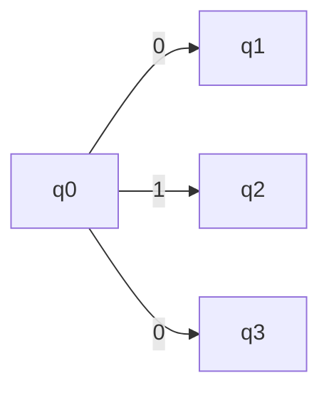
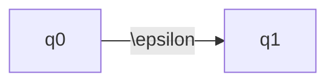
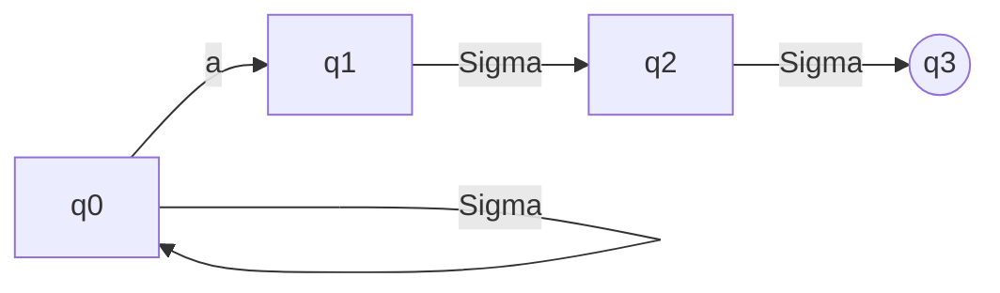
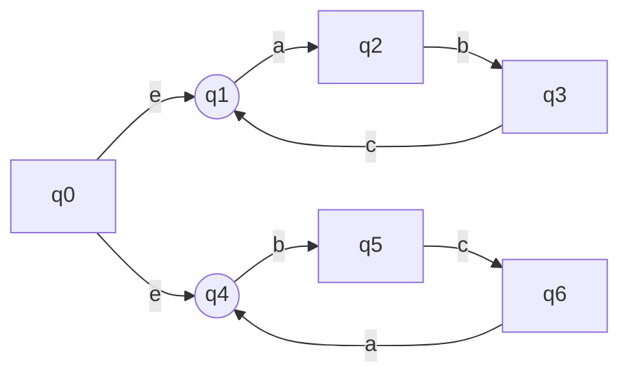

# Week Two, Discussion: Nondeterminism

## Nondeterministic Finite Automata

DFAs are motivated by the fact that computers must occupy a finite number of states since they occupy a finite physical space. However, this can get inconvenient to express. So, we need a more powerful model to extend the computations we can make. 

Note that computers are **still not able** to solve the **palindrome problem**:

$$
\text{Palindrome} := \{xx^R \, | \, x \in \Sigma^*\}
$$

We just think we can because we don't use extremely large strings.

For NFAs, we allow **multiple parallel computation** by allowing our NFA to make a *choice* among multiple options.

$q0$ is able spawn off multiple copies of the machine: one to follow $q1$ and one to follow $q3$.

NFAs are allowed to have $\epsilon$ transitions, which always split the machine into two (or however many epsilons there are): one for each epsilon and one to stay put.

If any thread of computation is in an accepting state when the input is processed, the *entire NFA accepts*.

ex: Create an NFA which accepts strings such that the third-to-last character is "a."

This is **much** simpler than any possible DFA.

Create an NFA which accepts strings that alternate "abc" and strings that alternate "bca."

See above that we basically combined two different NFAs (i.e. two different languages) into one. More generally, this is called the **closure over union** of regular languages. The union of two regular languages is also regular.

$$
L_1 \cup L_2
$$

## Classes of Languages

We can have classes of languages, a set of sets (since languages are sets of strings).

Is the DFA language a subset of the NFA language? Or are they equal?

Observe that we can take any set of states (nodes) from the NFA and take the power set:

$$
Q_N := \{1, 2, 3\}\\
Q_D := \mathscr{P}(Q_N) = \{\{\}, \{1\}, \{2\}, \{3\}, \{1,2\},\\
\{2,3\}, \{1,3\}, \{1,2,3\}\}
$$

We can then model the NFA's state transitions in the DFA as transitions from one set to another.
