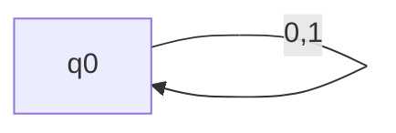
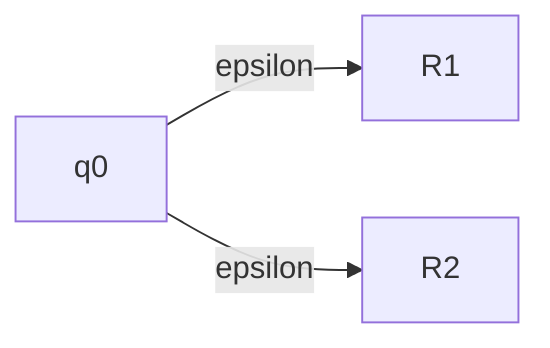
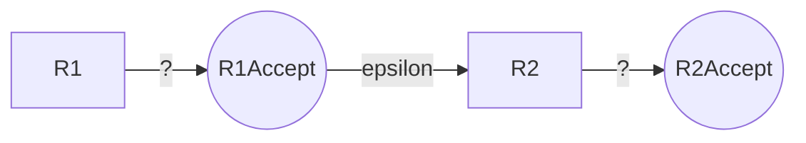
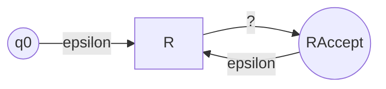

# Week Three, Discussion: Regular Expressions, Pumping Lemmas, Context-Free Grammars

## HW2 Induction

**Inductive Fallacies**!

Prove: any maximum-leaf k-ary tree of height n (edges) has k<sup>n</sup> leaves.

The base case is indeed k<sup>0</sup> = 1 which corresponds to a root, leaf node (possible!).

**Wrong**: Assume we have a tree of height n which has k<sup>n</sup> leaves. Attach k nodes to all those leaves. Now we have k • k<sup>n</sup> = k<sup>n+1</sup> leaves. Done.

This is WRONG because you must actually *start* with a tree of height n+1 and show how to construct a maximum leaf tree.

## Regular Expressions

RegEx in programming *IS NOT* like RegEx in formal theory.

- Programming RegEx is more powerful with features like forward lookahead and capturing.

- Formal RegEx does NOT have this.

Some notational things:

- $0^* := \{0\}* = \{\epsilon, 0,00,000,\dots\}$

- $\{0,1\}^* = \{\epsilon, 0,1,00,01,10,11, \dots\}$

$$
01^* \cup 0^*1 = 
(\{0\} \circ \{1\}^*) \cup (\{0\}^* \circ \{1\}) \\
= \{0,01,011,0111,\dots\} \cup \{1,01,001,\dots\}
$$

Rules for RegEx:

1. $a \in \Sigma$ is one character
   
   1. $a$ is implicitly the set containing it i.e. $a := \{a\}$

2. $Ø := \{\}$

3. Union: $1 \cup \epsilon := \{1,\epsilon\}$

4. Concatenation: $(0 \cup \epsilon) \circ (1 \cup Ø)$
   
   1. $= \{0,\epsilon\} \circ \{1\}$
   
   2. $= \{01,(\epsilon)1\}$

5. Kleene-star :star2: $R^*$ where R is a regular expression
   
   1. All the above describe *finite* languages. No matter how many concatenations you do, it will be finite.
   
   2. Kleene-star describes *infinite* languages :night_with_stars:
   
   3. $((0\cup\epsilon)\circ(1\cupØ))^*$
   
   4. $= (\{01,1\})^*$
   
   5. $= \{\epsilon, 01, 1, 011, 101, \dots\}$

### DFA from RegEx

Literals:

$$
R := \{0\}
$$

```mermaid
graph LR
    q0--0-->0((0))
    q0--1-->x
    0--0,1-->x
    x--0,1-->x
```

Empty string (accept nothing (accept literally nothing)):

$$
R := \{\epsilon\}
$$

```mermaid
graph LR
    q0((q0))--0,1-->x
    x--0,1-->x
```

Empty language (accept nothing (reject everything)):

$$
R := Ø = \{\}
$$



Union of two regular expressions:

$$
R := R_1 \cup R_2
$$



Concatenation of two regular expressions:

$$
R := R_1 \circ R_2
$$

Accept the strings where the first half comes from R<sub>1</sub> and the second half comes from R<sub>2</sub>



Kleene-star:

$$
R^*
$$

Basically, any string accepted by R will also be accepted by R<sup>*</sup>, so we can just re-use the machine for R with an additional entry point to accept the empty string:



 
