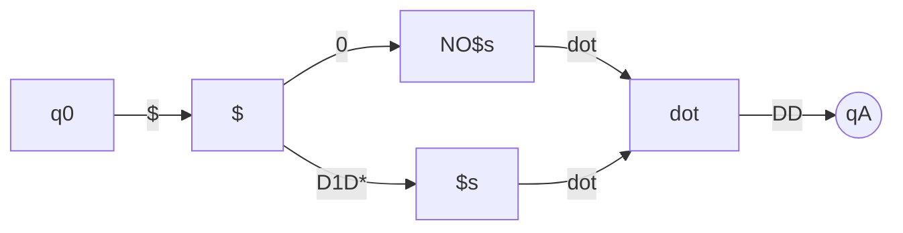

# Week Three, Lecture Two

## Recap

### Context-Free Grammars

Just like finite state languages can be represented by a finite state machine, context free languages can be represented by context-free grammars.

Remember the small part of the CFL block on the Chomsky Hierarchy from week one and the professor said we would cover it later? Well, those are the **inherently ambiguous CFLs**.

A given **context-free grammar** (CFG) "G" consists of:

$$
G := (V, \Sigma, R, S)
$$

- V = set of variables

- $\Sigma$ = alphabet

- R = **rewriting/substitution rules**

- S = **starting variable**

L(G) is the *language* of G i.e. the set of all strings G generates.

When you take a given word $w \in \mathscr{L}(G)$, you can view "w"  by expanding the nodes of the parse tree (which starts at "S") and viewing the derivation.

### Derivations

Two types of derivations for any given tree:

1. **Exactly left-most**

2. **Exactly right-most**

These two derivations are NOT equal, but the bottoms of both (i.e. all terminal symbols) will both evaluate to "w."

### Ambiguity

If w has more than one tree, w is **ambiguous** in G.

- i.e. there is more than one way to derive the same word

If a grammar G generates even one ambiguous word, the **grammar itself** is ambiguous.

- This DOES NOT mean the language created by G is ambiguous though!

For a language L to be ambiguous, ALL grammars for L are ambiguous.

- If L has just one unambiguoous grammar, then it is NOT ambiguous.

There is **no algorithm** to determine ambiguity.

- It is easy to show a grammar is ambiguous: just find one ambiguous string.

- It is hard to show a grammar is unambiguous. There is no algorithm for doing so.

Given a grammar, can you show that the language L(G) is unambiguous?

- Yes, but it is very difficult, as you have to show that the *infinite* set of grammars are all unambiguous.

An **inherently ambiguous language** is a **non-regular language**, but we won't get to that for awhile.

## Generalized NFAs (GNFAs)

GNFAs were invented to simplify proofs.

Imagine a DFA. It has its transition function $\delta : (Q \times \Sigma) \rightarrow Q$.

An NFA has its transition function $\delta : (Q \times (\Sigma \cup \{\epsilon\})) \rightarrow Q$.

Therefore, the "G" in "GNFA" means to generalize the transition function so that we can label the edges of the machine with an entire regular expression: $\delta : (Q - \{F\}\times Q - \{q_0\}) \rightarrow \mathscr{R}$ where $\mathscr{R}$ is "all possible regular expressions over $\Sigma$."

- We have a function which, for every possible pair of nodes, gives us the regular expression which can transition from one to another.

- This allows us to "skip over" input symbols, unlike in NFAs and DFAs.

- The complicated-looking part about $- \{q_0\}$ just means we can't transition into the starting symbol with a regular expression.

- Similarly, we cannot transition into the accepting state $F$ (also called $q_A$). In GNFAs, we can **only have one accepting state**.

$$
\text{GNFA} := (Q,\Sigma,\delta,q_0,q_A)
$$

GNFAs are allowed to transition from two nodes $p$ and $q$ on any input sequence of zero or more symbols as long as those symbols match $R$.

i.e. GNFAs **do pattern matching** to transition between two nodes.

ex: USD currency notation :moneybag::

$$
D := 0\dots 9\\
D_1 := 1 \dots 9
$$

## Pumping Lemma :muscle:

The pumping lemma lets us prove that a language is **not** regular.

If L is a finite state language then there exists a constant p (that depends only on L) such that for every string s in L, if s is longer than p:

- There exists substrings x, y, z such that s can be represented as s=xyz
  
  - No overlaps! :no_good_man:

- x and z are in Sigma-star $x,z \in \Sigma^*$

- y is in Sigma-plus $y \in \Sigma^+$

- y is longer than 0 (i.e. y is not the empty string)

- len(x) + len(y) <= p

- for all i, xyiz is in L
  
  - "x, y repeated i times, z"
  
  - **the most important one**

### Example

$$
\Sigma := \{a,b\}\\
L := \{ww | w \in \Sigma^*\}
$$

1. To prove that L is **not** an FSL, suppose by contradiction that L was an FSL.

2. Because L is an FSL, the pumping lemma applies

3. Then there is some number "p" for every string "s" in L that is longer than "p" such that:
   
   1. there exists some x,y,z such that s = xyz
   
   2. len(xy) <= p
   
   3. len(y) >= 1
   
   4. for all i, xyiz is in L

4. Choose "s" = apbapb

5. s is in L because "w" = apb

6. Per (3.1), s = xyz
   
   1. Note that (3.1) just says *there exists*, not *for all*!
   
   2. So we can't just show some particular xyz doesn't work out. We have to show that NO xyz works.

7. Since len(xy) <= p, we know that xy must consist just of ap
   
   1. If not, say we added the "b," then - since we have "p" repetitions of "a" - the len(xy) would be GREATER than p.

8. Thus:
   
   1. x = an for some n >= 0
   
   2. y = am for some m >= 1

9. Per (7), "z" consists of the rest of the "abab" string:
   
   1. z = a(p-n-m)bapb

10. Per (8) and (9.1):
    
    1. s = anama(p-n-m)bapb

11. Let i = 0, then s' = xy0z

12. s' = ana(p-n-m)bapb

13. (12) is NOT in L because it can never be "ww" since the first half has fewer a's than the second half.

14. Contradiction! :warning: (13) and (3.4)

