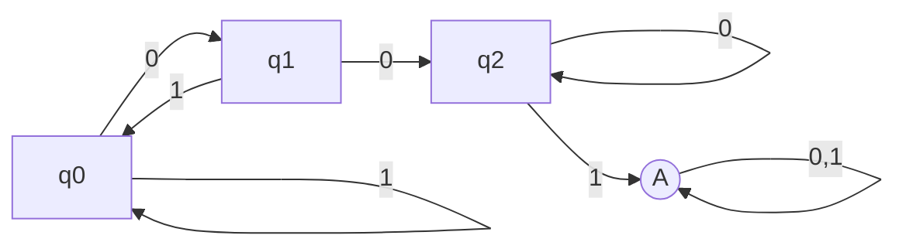

# Chapter One: Regular Languages
When we ask our central question "What is a computer?" we don't mean the realized, physical object, which is full of real-world, irrelevant minutiae. We focus instead on a **computational model**. We need several different computational models to fully model the real world computer however. The simplest of these is the...

## Finite Automaton
A **finite state machine** (FSM) is a 5-tuple `(Q,∑,δ,q0,F)` (kedkwof) computational model.
- `Q` = finite set of **states**
    - A node in a state diagram
- `∑` = alphabet = finite set of **symbols**
- `δ` = `δ: Q x ∑ → Q` is the **transition function**
    - `δ(q,e1) = q'`
    - A labeled arrow in a state diagram
    - Can think of it as a table with two axes: possible current states and input symbols (i.e. `Q x ∑`) with the cells being next states
- `q0` = start state
    - Designated with -> on state diagram
    - If `q0 ⊆ F`, then the FSM accepts the **empty string** ε
- `F` = finite set of **accept states**
    - F ⊆ Q
    - Double circled on state diagram

FSMs accept several strings, but only recognize one language. Even if the FSm accepts no strings, then it recognizes the empty language Ø.

FSMs model computers with *limited memory* and most closely approximate embedded systems and electromechanical devices.
- ex: automatic doors, elevators, thermostats, watches

An automatic door has a front and a rear sensor, which represent the input (or lack thereof) to the system.
- `Q = {OPEN, CLOSED}`
- `∑ = {FRONT, REAR, NEITHER, BOTH}`
- `q0 = CLOSED` (usually? i would assume)
- `F` is not super fitting, but I guess `OPEN` is the "accepting" state?
- `δ`:

|      |FRONT|REAR  |NEITHER|BOTH  |
|------|-----|------|-------|------|
|CLOSED|OPEN |CLOSED|CLOSED |CLOSED|
|OPEN  |OPEN |OPEN  |CLOSED |OPEN  |

Markov chains

**Markov chains** are a probabilistic version of FSMs and are used in speech processing, OSR, and financial market modeling.

## Regular Language
A language is a **regular language** if an FSM accepts *every* string in the language.

**Example 1.21**

To talk about languages and do more useful things with them, we have to define the **regular operations** on languages, which are analogous to addition and multiplication in arithmetic.
- **Union**: A ∪ B = `{x|x ∈ A or x ∈ B}`
    - Any string that was valid in A or B is now valid
- **Concatentation**: A ◦ B = `{xy|x ∈ A and y ∈ B}`
    - Attach every string from B to the end of every string in A
    - If A = {"milk", "fruit"} and B = {"tea", "y"}, then A ◦ B = {"milktea", "milky", "fruittea", "fruity"}.
- **Star**: A\* = `{x1x2...x_k|k ≥ 0, x_i ∈ A}`
    - *Unary operation*!
    - Basically, the permutation of every string in a language
    - Since the absence of a string is a possibility, the empty string ε is also a part of A\*
    - If A = {"milk", "fruit"}, then A\* = {ε, "milk", "fruit", "milkfruit", "fruitmilk", "milkmilk", "fruitfruit", "milkmilkfruit", ...}

For a set to be **closed** under an operation, it means that, given x and y in the set - or x if the operation is unary - the result of operation(x,y) is still in the set.
- `x ∈ A, y ∈ A, operation(x,y) ∈ A`

To prove that all the regular language operations are closed, we must cover **nondeterminism**.

## Nondeterminism
As the name suggests, **nondeterministic finite automata** (NFA) have a less linear execution order, with several or no choices existing at any point in the computation.

Where a DFA has one state transition/outgoing arrow per symbol in the alphabet for every state/node in the machine, an NFA can have any number of state transitions (including zero) per alphabet symbol. Also, an NFA can even have arrows labelled with the empty string ε.

An NFA computes in a *branched* manner. For every state with multiple transitions for the current symbol, an NFA will split multiple copies of itself and follow **all** branches/possibilities at once. Each copy executes concurrently from there. If the current branch of computation encounters a dead end, with no state transition/outgoing arrow for its symbol, that branch and its associated machine will die. If it encounters arrows labelled with ε, the branch will branch further, spawning one copy for each ε arrow, in addition to one to stay at the current state. If - at any point - *any* branch ends in an accepting state, the NFA as a whole will accept the input.

Basically, the algorithm is as follows:
1. Execute deterministically
2. If multiple arrows for current symbol, branch for each one
3. If ε arrow(s), spawn one copy for each ε and continue from current node
4. If no arrow for current symbol, die
5. If end of input and in accepting state, entire computation accepts

Visually, you can imagine an NFA as an umbrella-style, branched execution, with multiple branch points. A DFA, in comparison, is linear, with a straight line of execution since it must have exactly one transition per symbol. This also helps show that **nondeterminism is a generalization of determinism**. Every DFA is also an NFA. This makes sense visually, as a linear execution order is just a subset of a branch.

Don't let NFAs mystify you. Every NFA can be converted into a DFA and can often be smaller or even easier to understand.

The actual definition of an NFA is identical to a DFA, except for the transition function δ.
- DFA: `δ: Q x ∑ --> Q`
- NFA: `δ: Q x ∑_ε --> P(Q)`
    - `∑_ε` is the alphabet of the language union with the empty string ε
    - `P(Q)` is the power set of possible next states. This is really what makes NFAs nondeterministic. They don't have to return *one* next state, but instead a set of possibilities.

